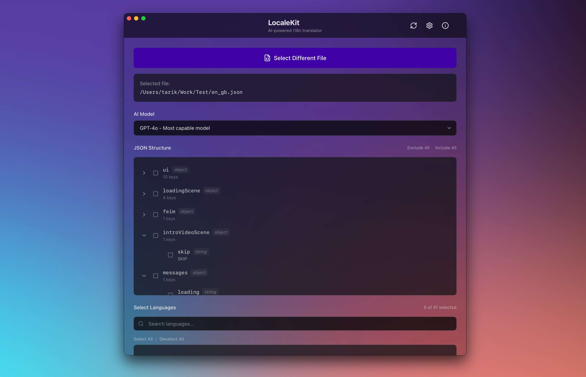
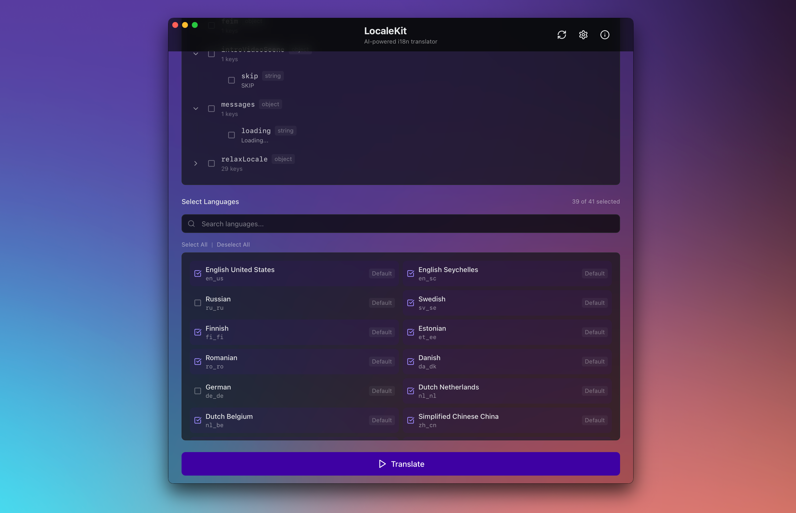
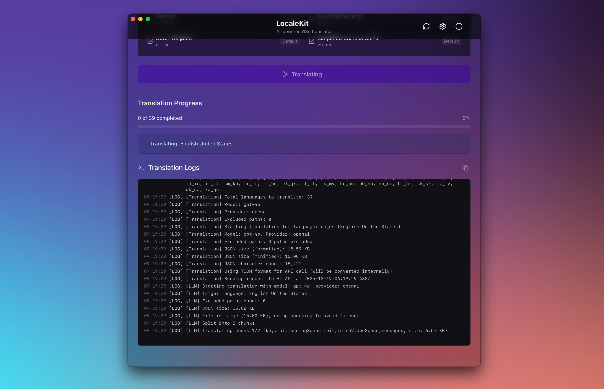

# LocaleKit

AI-powered i18n translator for JSON files. Translate your JSON files into multiple languages using advanced AI models.

## Features

- **Visual JSON Structure Viewer**: Selectively exclude nodes from translation
- **Multi-Language Support**: Translate to 40+ languages with custom language support
- **AI-Powered Translation**: Uses OpenAI, Anthropic, Mistral, and OpenRouter models
- **Comprehensive Model Support**: Supports all OpenAI models including GPT-5 series
- **Secure API Key Storage**: OS-level secure storage for API keys
- **Progress Tracking**: Real-time progress indicators during translation
- **File Management**: Automatic file naming with language codes and overwrite protection

## Installation

Download the latest release from [GitHub Releases](https://github.com/yourusername/LocaleKit/releases) and install:

- **macOS**: Download the `.dmg` file, open it, and drag LocaleKit to Applications
- **Windows**: Download the `.msi` installer and run it
- **Linux**: Download the `.AppImage` or `.deb` package for your distribution

## How it works

1. Select a source JSON file
2. Select an AI model
3. Review and exclude nodes you don't want translated
4. Select target languages
5. Click Translate
   - Your JSON is automatically converted to TOON (Token-Oriented Object Notation).
     A more compact format that reduces API payload size and token usage, making translations faster and more cost-effective
   - Large files are automatically split into smaller chunks, translated separately, and then merged back together to prevent timeouts and handle files of any size
6. Files are saved to the location of the source file
7. If any languages fail, they remain selected in the Language Selector so you can retry immediately after reviewing the errors
8. After completion, you'll see a summary of languages with warnings so you can inspect them before proceeding

## Settings

Configure API keys and manage languages in Settings:

- **App Settings Tab**: Change the app language
- **Languages Tab**: Add, edit, or delete custom languages
- **API Keys Tab**: Manage API keys for different providers
- **Usage Tab**: View usage statistics and manage usage period



> Lading file and JSON Structure



> Selecting languages



> Translation progress and logs

## Development

### Prerequisites

- Node.js 20+
- pnpm
- Rust (for Tauri)

### Building from Source

```bash
# Install dependencies
pnpm install

# Run in development
pnpm tauri:dev

# Build for production
pnpm tauri:build
```

### Adding new languages

1. Add the language code to the `getAvailableLocales()` function in `lib/i18n/locale.ts`:

```ts
export function getAvailableLocales(): string[] {
  return ["en_gb", "tr_tr", "your_locale_code"];
}
```

2. Add the locale name mapping to the `getLocaleName()` function in the same file:

```ts
export function getLocaleName(locale: string): string {
  const names: Record<string, string> = {
    en_gb: "English (UK)",
    tr_tr: "Türkçe (Turkish)",
    your_locale_code: "Your Language Name",
  };
  return names[locale] || locale;
}
```

3. Create a new JSON file in the `messages/` folder named `{locale_code}.json` (e.g., `en_us.json`) with the same structure as the existing language files. Copy the structure from `messages/en_gb.json` and translate all the values.

## Contributing

1. Fork the repository
2. Create a feature branch: `git checkout -b feature-name`
3. Make your changes
4. Test thoroughly
5. Submit a pull request

## License

MIT License

## Support

- **Issues**: [GitHub Issues](https://github.com/tarikkavaz/LocaleKit/issues)
- **Releases**: [GitHub Releases](https://github.com/tarikkavaz/LocaleKit/releases)
